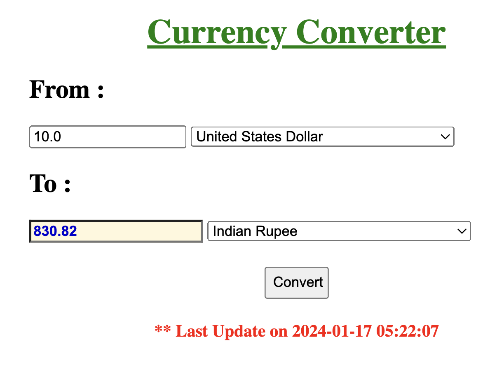

## Run Locally and Have Fun :-)





```bash

mkdir CURRENCY-CONVERTER && cd CURRENCY-CONVERTER
```

Inside it create two file app.py and requirements.txt,

```bash
touch app.py
touch requirements.txt
```
```bash
mkdir templates && cd templates && touch home.html
```
Edit requirements.txt

```bash
Flask>=1.1.2
requests>=2.23.0
```


```bash
pip install -r requirements.txt
```
```bash
python3 app.py
```
